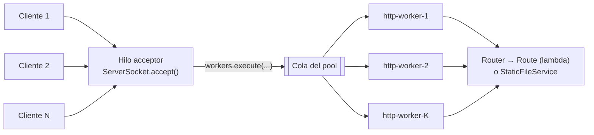
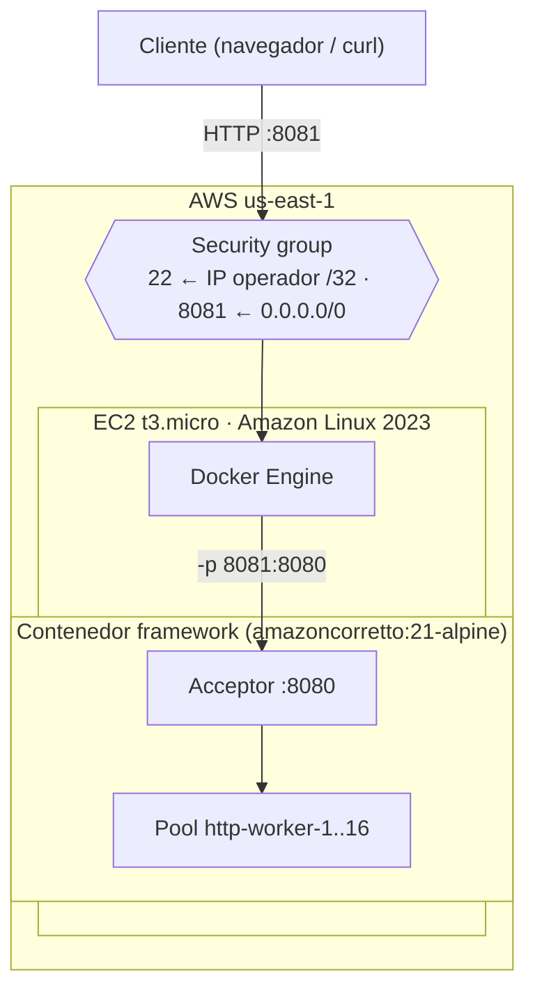
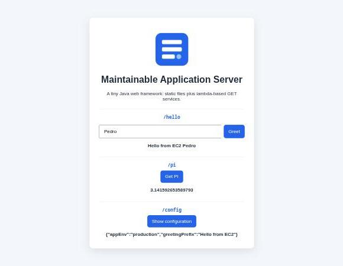

# Framework web propio: concurrencia, apagado elegante, Docker y AWS EC2

Extensión del framework web propio del curso (sin Spring), desarrollado originalmente en
[Building-and-Deploying-a-Maintainable-Application-Server](https://github.com/0x0000cbsx/Building-and-Deploying-a-Maintainable-Application-Server).
En esta entrega el servidor pasa de atender **una petición a la vez** a atenderlas **concurrentemente** con un pool de hilos, se apaga de forma **elegante** (termina las peticiones en curso antes de salir, también ante `docker stop`), toma su configuración de **variables de entorno**, corre en un **contenedor Docker** basado en Amazon Corretto 21 y está **desplegado en AWS EC2**.

## Enlaces rápidos

| | |
|---|---|
| URL pública (EC2) | http://ec2-98-92-41-152.compute-1.amazonaws.com:8081/ |
| Endpoint de ejemplo | http://ec2-98-92-41-152.compute-1.amazonaws.com:8081/greeting?name=AWS |
| Commit de la extensión | [`5837ceb` — Implement concurrent request handling and graceful shutdown](https://github.com/0x0000cbsx/Containerizing-and-Deploying-a-Java-Web-Application---Framework-extension/commit/5837ceb) |
| Commit base (framework previo) | [`987f201` — Import baseline web framework from previous assignment](https://github.com/0x0000cbsx/Containerizing-and-Deploying-a-Java-Web-Application---Framework-extension/commit/987f201) |
| Video de demostración | *(enlace al video)* |

## Stack

- Java 21 (sin dependencias en tiempo de ejecución; JUnit 5 solo para pruebas)
- Maven 3.9
- Docker: build multi-etapa con `maven:3.9-amazoncorretto-21` e imagen final `amazoncorretto:21-alpine`
- AWS EC2 con Amazon Linux 2023

## Estado actual del framework

El framework ofrece una API mínima al estilo de Spark/Express:

```java
staticfiles("/webroot");                                        // archivos estáticos desde el classpath
get("/hello", (req, resp) -> "Hello " + req.getValue("name"));  // servicios REST con lambdas
start();                                                        // puerto desde PORT
```

| Capacidad | Estado |
|---|---|
| Rutas `GET` con lambdas (`Route`), parámetros de query (`req.getValue`) | Heredado del framework base |
| Archivos estáticos (HTML, CSS, JS, imágenes) desde classpath o `STATIC_FILES_PATH`, con protección contra *path traversal* | Heredado |
| Respuestas `400` / `404` / `405` / `500` sin tumbar el servidor | Heredado |
| **Atención concurrente de peticiones** (pool de hilos) | **Nuevo** |
| **Apagado elegante** (`stop()`, SIGTERM / `docker stop`, Ctrl+C) con timeout | **Nuevo** |
| **Configuración por entorno**: `PORT`, `WORKER_THREADS`, `SHUTDOWN_TIMEOUT_SECONDS` | **Ampliado** (antes solo `PORT`) |
| **Imagen Docker** Java 21 / Corretto, usuario no-root | **Actualizado** |
| **Despliegue en AWS EC2** | **Hecho** (ver evidencia) |

Limitaciones conocidas: solo `GET`, sin *keep-alive* (`Connection: close`), sin HTTPS (se delegaría a un balanceador o *reverse proxy*).

## Cambios introducidos en la extensión

Todo el cambio está en el commit [`5837ceb`](https://github.com/0x0000cbsx/Containerizing-and-Deploying-a-Java-Web-Application---Framework-extension/commit/5837ceb). El commit anterior, `987f201`, es el framework base sin modificaciones, así que `git diff 987f201 5837ceb` muestra exactamente la extensión.

### 1. Atención concurrente

**Antes:** el ciclo de `accept()` atendía la conexión en el mismo hilo; una petición lenta bloqueaba a todas las demás.

**Ahora:** el hilo que acepta conexiones solo las entrega a un `ExecutorService` de tamaño fijo (`WORKER_THREADS`, por defecto 16). Cada petición corre en un hilo `http-worker-N`.



- **Pool acotado en vez de un hilo por conexión:** limita memoria y cambios de contexto; ante picos las conexiones esperan en la cola en lugar de agotar la JVM.
- **Seguridad entre hilos:** `Request`/`Response` se crean por petición y no se comparten; `StaticFileService` no tiene estado mutable; el `Router` pasó a `ConcurrentHashMap` porque todos los workers lo leen; el contador de peticiones activas es un `AtomicInteger`.
- Los logs incluyen el hilo que atendió la petición (`[http-worker-3] GET /greeting -> 200`), lo que hace visible la concurrencia.

### 2. Apagado elegante

**Antes:** `stop()` solo funcionaba entre peticiones y no esperaba nada; matar el proceso cortaba las respuestas en curso.

**Ahora** (`HttpServer.stop()` + `drain()`):

1. `stop()` marca el servidor como detenido y **cierra el `ServerSocket`**: las conexiones nuevas se rechazan de inmediato. Retorna sin bloquear, así que puede llamarse desde un handler (como `/shutdown` en desarrollo).
2. El hilo acceptor sale del ciclo y llama a `workers.shutdown()`: **las peticiones ya aceptadas terminan normalmente**.
3. Espera hasta `SHUTDOWN_TIMEOUT_SECONDS` (por defecto 8 s). Si alguna petición sigue colgada, `shutdownNow()` la interrumpe para que el apagado no se bloquee para siempre.
4. `awaitStopped()` permite a otro hilo esperar hasta que todo se haya drenado.

`WebFramework.start()` registra un **shutdown hook de la JVM**, por lo que `SIGTERM` (lo que envía `docker stop`) y `Ctrl+C` disparan exactamente ese proceso antes de que termine la JVM:

```
Shutdown signal received, stopping server...
Shutting down: waiting up to 8s for 1 in-flight request(s)
[http-worker-12] GET /slow -> 200
Server stopped gracefully.
```

El timeout por defecto (8 s) es menor que el periodo de gracia de `docker stop` (10 s), para que el drenado termine antes de que Docker envíe `SIGKILL`. El `ENTRYPOINT` usa la forma *exec*: `java` es el PID 1 del contenedor y recibe la señal directamente. El código de salida `143` (128 + SIGTERM) es el esperado para una JVM que termina por esa señal.

### 3. Configuración por variables de entorno

| Variable | Por defecto | Uso |
|---|---|---|
| `PORT` | `8080` | Puerto de escucha (0–65535; un valor inválido produce un error claro al arrancar) |
| `WORKER_THREADS` | `16` | Tamaño del pool de workers (entero ≥ 1) |
| `SHUTDOWN_TIMEOUT_SECONDS` | `8` | Tiempo máximo para drenar peticiones al apagar (entero ≥ 1) |
| `APP_ENV` | `development` | En `production` no se registra `/shutdown` |
| `GREETING_PREFIX` | `Hello` | Prefijo del endpoint `/hello` |
| `STATIC_FILES_PATH` | *(classpath `/webroot`)* | Directorio externo de archivos estáticos |

La lectura está centralizada en `Config`, que falla rápido con un mensaje explícito ante valores inválidos (`Invalid WORKER_THREADS value: '0' (expected an integer >= 1)`).

### 4. Aplicación de ejemplo

| Endpoint | Respuesta |
|---|---|
| `GET /` | Página estática (`index.html`, CSS, JS, imagen) |
| `GET /greeting?name=Pedro` | `Hello, Pedro!` (mismo contrato que el workshop) |
| `GET /hello?name=Pedro` | `<GREETING_PREFIX> Pedro` |
| `GET /pi` | `3.141592653589793` |
| `GET /config` | JSON con `APP_ENV` y `GREETING_PREFIX` |
| `GET /slow?ms=2000` | Simula trabajo lento (máx. 30 s); sirve para demostrar concurrencia y drenado |
| `GET /shutdown` | Solo con `APP_ENV=development`: apaga el servidor elegantemente |

## Estructura

```
├── pom.xml
├── Dockerfile
├── scripts/
│   ├── collect-docker-evidence.sh   # evidencia local en Docker
│   └── ec2-deploy.sh                # instalación de Docker y despliegue en EC2
├── src/main/java/co/edu/escuelaing/
│   ├── webframework/                # el framework
│   │   ├── WebFramework.java        # API estática: get, staticfiles, start, stop (+ shutdown hook)
│   │   ├── HttpServer.java          # acceptor + pool de workers + drenado
│   │   ├── Config.java              # variables de entorno
│   │   └── Router, Route, Request, Response, StaticFileService
│   └── app/Application.java         # aplicación de ejemplo
├── src/main/resources/webroot/      # archivos estáticos
├── src/test/java/...                # 36 pruebas
└── docs/evidence/                   # evidencia citada en este README
```

## Construir y ejecutar

```bash
mvn clean package          # compila y corre las 36 pruebas
java -jar target/app.jar   # escucha en 8080

PORT=9000 WORKER_THREADS=4 java -jar target/app.jar
curl "http://localhost:9000/greeting?name=Pedro"   # Hello, Pedro!
```

Sin Maven instalado, se puede compilar dentro de un contenedor:

```bash
docker run --rm -v "$PWD":/src -w /src maven:3.9-amazoncorretto-21 mvn -B clean package
```

### Pruebas

| Suite | Qué verifica |
|---|---|
| `WebFrameworkTest` (17) | Parsing de peticiones, router, archivos estáticos, MIME, `Config` (incluye `WORKER_THREADS` y `SHUTDOWN_TIMEOUT_SECONDS`) |
| `HttpServerIntegrationTest` (14) | Extremo a extremo por sockets: rutas, estáticos binarios, 400/404/405/500, `/shutdown` |
| `ConcurrencyAndShutdownTest` (5) | 6 peticiones de 600 ms terminan en < 1,2 s (en serie serían 3,6 s) y en workers distintos; una petición rápida no espera a una lenta; `stop()` rechaza conexiones nuevas pero deja terminar la que está en curso; `awaitStopped()` no retorna antes del drenado; el timeout interrumpe peticiones colgadas |

```
Tests run: 5,  Failures: 0, Errors: 0, Skipped: 0 -- in co.edu.escuelaing.webframework.ConcurrencyAndShutdownTest
Tests run: 14, Failures: 0, Errors: 0, Skipped: 0 -- in co.edu.escuelaing.webframework.HttpServerIntegrationTest
Tests run: 17, Failures: 0, Errors: 0, Skipped: 0 -- in co.edu.escuelaing.webframework.WebFrameworkTest
```

## Ejecutar en Docker

`Dockerfile` (multi-etapa):

```dockerfile
FROM maven:3.9-amazoncorretto-21 AS build
WORKDIR /build
COPY pom.xml .
RUN mvn -q -B dependency:go-offline
COPY src ./src
RUN mvn -q -B clean package

FROM amazoncorretto:21-alpine
WORKDIR /app
COPY --from=build /build/target/app.jar app.jar
ENV APP_ENV=production GREETING_PREFIX=Hello PORT=8080 WORKER_THREADS=16 SHUTDOWN_TIMEOUT_SECONDS=8
EXPOSE 8080
RUN adduser -S -u 1001 appuser
USER appuser
ENTRYPOINT ["java", "-jar", "app.jar"]
```

- La etapa de build compila y **corre las pruebas** dentro de Docker: si fallan, no se genera la imagen.
- La imagen final solo contiene el JRE Corretto 21 y el jar, y corre como usuario **no-root**.
- Se usa `amazoncorretto:21-alpine` porque la variante `amazoncorretto:21` (AL2023 mínimo) no incluye `useradd` para crear el usuario sin privilegios.

```bash
docker build -t 0x0cbsx/framework-extension:1.0 .
docker run -d --name fw -e PORT=8080 -p 35000:8080 0x0cbsx/framework-extension:1.0
curl "http://localhost:35000/greeting?name=Docker"   # Hello, Docker!

# el puerto interno también se configura por entorno
docker run -d --name fw2 -e PORT=9090 -p 35001:9090 0x0cbsx/framework-extension:1.0

docker stop fw     # apagado elegante: drena las peticiones en curso
```

Todo lo anterior (build, endpoints, puerto por entorno, concurrencia y apagado) se reproduce con `./scripts/collect-docker-evidence.sh`.

## Despliegue en AWS EC2

| | |
|---|---|
| Instancia | `i-00826c764ef621848` — `t3.micro`, Amazon Linux 2023, `us-east-1`, EBS `gp3` 8 GiB |
| DNS público | `ec2-98-92-41-152.compute-1.amazonaws.com` |
| Security group | `virtualization-lab-sg`: 22/TCP solo desde la IP del operador (`/32`); 8081/TCP abierto para esta aplicación (8080 lo usa el workshop en la misma instancia) |
| Contenedor | `-p 8081:8080 -e PORT=8080 -e APP_ENV=production --restart unless-stopped` |



Pasos:

```bash
# 1. imagen: se construyó localmente y se copió a la instancia
docker save 0x0cbsx/framework-extension:1.0 | gzip | ssh -i <llave> ec2-user@<dns> 'gunzip | docker load'
#    (alternativa: docker push a Docker Hub y docker pull en la instancia)

# 2. en la instancia
scp -i <llave> scripts/ec2-deploy.sh ec2-user@<dns>:~
ssh -i <llave> ec2-user@<dns>
bash ec2-deploy.sh install    # instala y arranca Docker (volver a conectarse después)
bash ec2-deploy.sh run        # corre el contenedor en :8081 y guarda evidencia
```

Además de desplegar, `ec2-deploy.sh run` repite en la nube las pruebas de concurrencia y de apagado elegante, y al final deja el servicio arriba.

> La instancia corre en un AWS Academy Learner Lab: al cerrarse la sesión se detiene, y al reiniciarla AWS le asigna otra IP/DNS pública. Si la URL no responde, la evidencia de abajo documenta el despliegue funcionando.

## Evidencia

### Local (Docker) — [`docs/evidence/local-docker.txt`](docs/evidence/local-docker.txt)

Concurrencia: 5 peticiones de 2 s en paralelo tardan **~2,0 s** en total (en serie serían 10 s), cada una en un worker distinto, y una petición rápida responde en milisegundos mientras hay una lenta en curso:

```
Slow request finished after 2000 ms on http-worker-6
Slow request finished after 2001 ms on http-worker-7
Slow request finished after 2001 ms on http-worker-8
Slow request finished after 2000 ms on http-worker-9
Slow request finished after 2001 ms on http-worker-5
total: 2.026568045 s  (sequential would be ~10 s)

fast /greeting answered in 0.002565 s while /slow was running
```

Apagado elegante: `docker stop` con una petición de 4 s en curso. La petición **termina con 200**, `docker stop` espera a que se drene (~3 s, no los 10 s hasta el `SIGKILL`) y después las conexiones son rechazadas:

```
Slow request finished after 4000 ms on http-worker-12  <- in-flight request completed (HTTP 200)
docker stop took 3.134907552 s
curl exit code 7 (connection refused)

Shutdown signal received, stopping server...
Shutting down: waiting up to 8s for 1 in-flight request(s)
[http-worker-12] GET /slow -> 200
Server stopped gracefully.
```

Puerto por entorno: la misma imagen con `-e PORT=9090` escucha en 9090 (`Server listening on port 9090 with 16 worker threads`).

### AWS EC2 — [`docs/evidence/ec2-deployment.txt`](docs/evidence/ec2-deployment.txt)

```
$ docker ps
CONTAINER ID   IMAGE                             COMMAND               CREATED          STATUS          PORTS                                       NAMES
ef1d68bdcc48   0x0cbsx/framework-extension:1.0   "java -jar app.jar"   4 seconds ago    Up 3 seconds    0.0.0.0:8081->8080/tcp, :::8081->8080/tcp   framework
1037154c0b87   0x0cbsx/virtualization-lab:1.0    "java -jar app.jar"   19 minutes ago   Up 19 minutes   0.0.0.0:8080->6000/tcp, :::8080->6000/tcp   virtualization-lab

$ curl "http://ec2-98-92-41-152.compute-1.amazonaws.com:8081/greeting?name=AWS"   # desde fuera de AWS
Hello, AWS!
```

- Concurrencia en EC2: 5 × 2 s en paralelo → **2036 ms** dentro de la instancia; **2184 ms** desde fuera de AWS.
- Apagado elegante en EC2: la petición en curso termina con 200 y el log muestra `Server stopped gracefully.`




### Historial de commits

```
5837ceb Implement concurrent request handling and graceful shutdown
987f201 Import baseline web framework from previous assignment
```

## Video de demostración

*(enlace al video)*: muestra el `docker build` y la ejecución local, peticiones concurrentes a `/slow`, `docker stop` con drenado, y la aplicación respondiendo en la URL pública de EC2.
